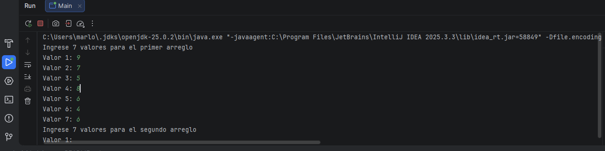
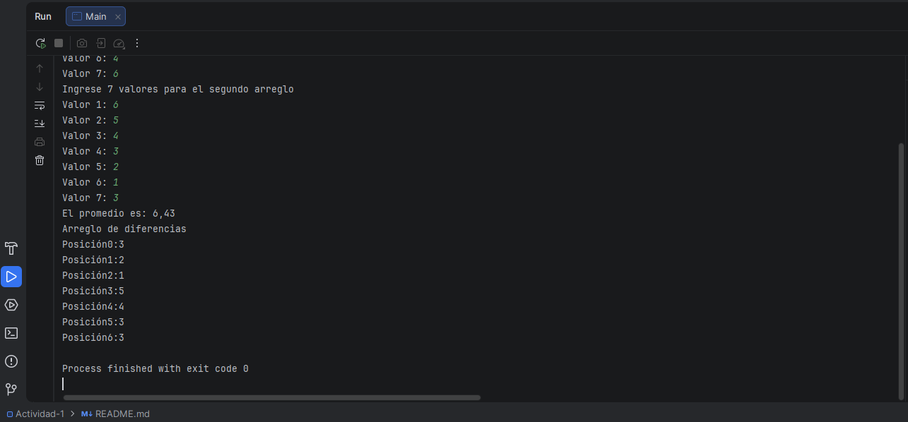

## Actividad 1

Aplicación de consola en Java para realizar operaciones con matrices.

### Objetivo del proyecto

El objetivo de este proyecto es:
- **Practicar la programación en Java** usando una aplicación de consola.
- **Trabajar con arreglos y matrices**, aplicando operaciones básicas (por ejemplo: suma, resta, producto u otras que hayas definido).
- **Reforzar el uso de estructuras de control**, métodos y manejo de entrada/salida por consola.

### Instrucciones de ejecución

**Requisitos previos**
- **Java JDK 17** (o la versión requerida por tu proyecto) instalado.
- Variable de entorno `JAVA_HOME` configurada (opcional pero recomendado).

**1. Compilar el proyecto desde consola**

Ubícate en la carpeta raíz del proyecto (donde está el código fuente) y ejecuta:

```bash
javac -d out src/*.java
```

Si utilizas paquetes, ajusta el comando a la estructura real de tu proyecto.

**2. Ejecutar la aplicación**

Suponiendo que tu clase principal se llama `Main` y está en el paquete por defecto (sin `package`):

```bash
java -cp out Main
```

Si tu clase principal está en un paquete (por ejemplo `com.ejemplo.actividad1`), usa el nombre completo del paquete:

```bash
java -cp out com.ejemplo.actividad1.Main
```

**Ejecución desde un IDE (IntelliJ IDEA, Eclipse, etc.)**
- Abre el proyecto en tu IDE.
- Configura el SDK de Java.
- Marca la clase `Main` como clase de ejecución.
- Ejecuta el programa con la opción de “Run” del IDE.

### Capturas de pantalla

